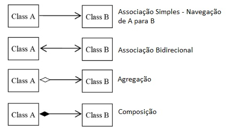
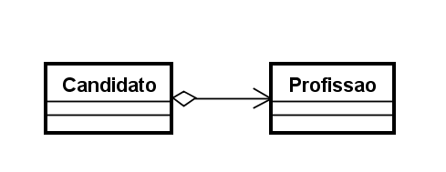
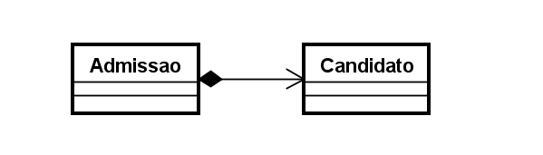
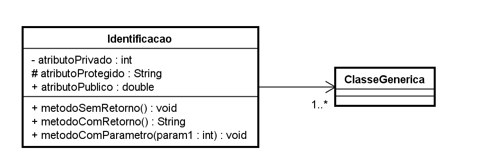
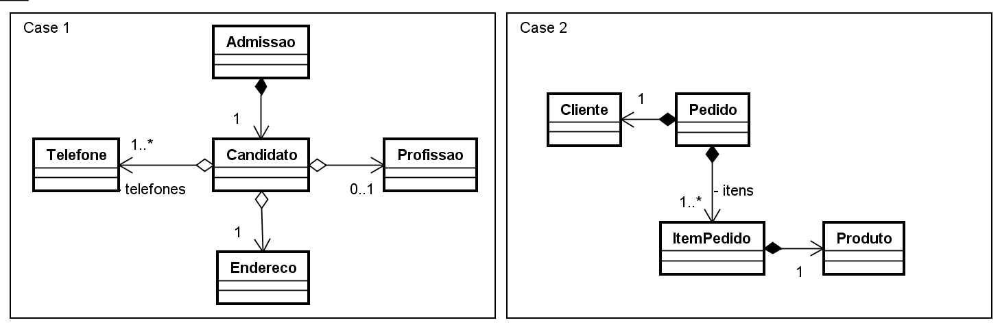
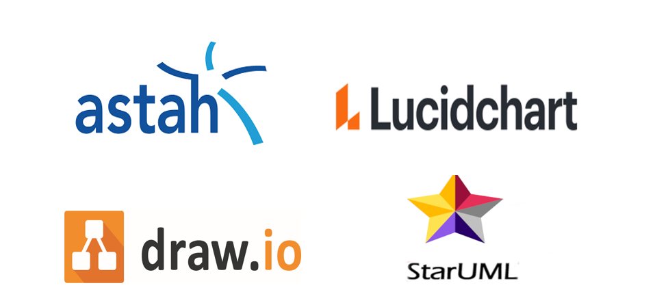

# UML

Linguagem de Modelagem Unificada ou UML, é uma notação, que possibilita a representação gráfica do projeto.

Na UML, temos três conceitos necessários para compreendermos inicialmente:

### Diagramas, elementos e relacionamentos.

As notações UML, são distribuídas em duas categorias de diagramas, a estrutural e comportamental conforme listagem abaixo:

## Diagramas estruturais

* **Diagrama de classe**: O Diagrama de Classes é utilizado para fazer a representação de, estruturas de classes de negócio, interfaces e outros componentes do sistema. Por esta característica, este diagrama é considerado o mais importante para a UML, pois auxilia a maioria dos demais diagramas.

* **Diagrama de objetos**: Este diagrama, representa os objetos existentes em um determinado instante ou fato na aplicação. Assim, conseguimos ter uma perspectiva do estado de nossos objetos, mediante a interação dos usuários no sistema.

`Existem outras categorias de diagramas estruturais e comportamentais, porém iremos focar nos citados acima.`

## Diagrama de classe
O diagrama de classes, ilustra **graficamente ** como classes serão estruturadas e interligadas entre si, diante da proposta do nosso software.

Em diagrama, a estrutura das classes é constituída por:

**Identificação**: Nome e/ou finalidade da classe;

**Atributos**: Propriedades e/ou características;

**Operações**: Ações e/ou métodos.

## Relacionamentos
Em um diagrama, as classes podem existir de forma independente, mas obviamente haverá, em alguma etapa da aplicação a necessidade de algumas se relacionarem, o que devemos compreender é, o nível de dependência entre elas:

**Associação**
Uma associação, define um relacionamento entre duas classes, permitindo que, um objeto tenha acesso a estrutura de um outro objeto.

**Agregação**: Em uma agregação, a classe principal contém uma relação com outra classe, mas ela pode existir, sem a classe agregadora. Imagina um cadastro de Candidatos, podemos encontrar candidatos que ainda não possuam uma profissão:

Candidato é classe principal e a Profissão, agregação.

**Composição**: A composição já caracteriza uma dependência existencial, entre a classe principal e a classe associada. Imaginamos que uma admissão só poderá existir, contendo suas informações básicas e a composição do candidato selecionado.

Admissão é a classe principal e Candidato compõe a Admissão, logo este SURGIRA uma composição entre Admissão e Colaborador - ver DDD

### Multiplicidade

Nem sempre o relacionamento entre as classes, será de um para um, em um determinado cenário poderá exigir multiplicidades específicas, conforme opções abaixo:

* 1. -> Representa uma associação, contendo um elemento;

* *. -> Representa uma associação, contendo uma lista de elementos;

* 0..1 -> Representa uma associação, contendo zero ou um elemento;

* 0..* -> Representa uma associação, contendo zero ou uma lista de elementos;

* 1..* -> Representa uma associação. contendo um ou uma lista de elementos.

## Visibilidade

Os atributos e métodos de uma classe, podem receber níveis de visibilidade, e na UML existem símbolos que representam cada um deles.

* (+) Visibilidade pública;

* (#) Visibilidade protegida (muito associada com herança);

* (-) Visibilidade privada.

## Representação

Ilustração utilizando a ferramenta Astah Community.

**Que tal praticar ?**

No momento da admissão, este Candidato deverá se tornar um Colaborador - ver DDD

## Ferramentas

Existem inúmeras ferramentas de diagramação, tanto online, como pagas e gratuitas.

StarUML Alternatives in 2021 - community voted on SaaSHub

**Referência**

UML e os Diagramas Estruturais
Micreiros.com

Entendendo o Diagrama de Classes da UML
Até o Momento

UML conceitos básicos

