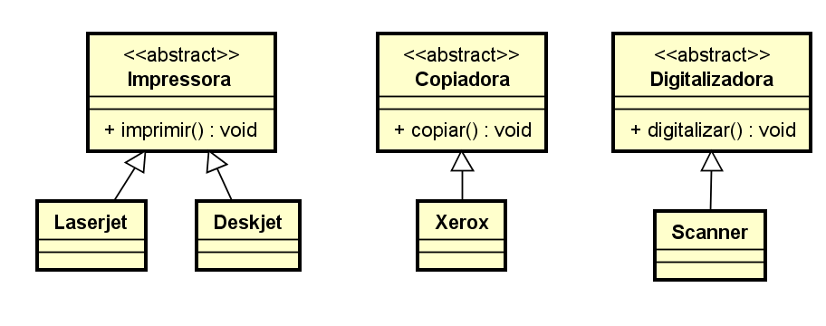

# Interface
`Antes de tudo, NÃO estamos nos referindo a interface gráfica. Tudo bem? 😁😉`

Como vimos anteriormente, Herança é um dos pilares de POO, mas uma curiosidade que se deve ser esclarecida, na linguagem Java, é que a mesma não permite o que conhecemos como Herança Múltipla.

A medida que vão surgindo novas necessidades, novos equipamentos (objetos), que nascem para atender as expectativas de oferecer ferramentas com finalidades bem específicas, como por exemplo: Impressoras, Digitalizadoras, Copiadoras e etc.

Observem que não há uma especificação de marca, modelo e ou capacidades de execução das classes citadas acima, isto é o que consideramos o nível mais abstrato da orientação a objetos, que denominamos como interfaces.

Ilustração de interfaces dos equipamentos citados acima:

Representação de objetos reais com base nas interfaces citadas acima:

Então, o que você está dizendo é que interfaces, é o mesmo que classes? Um molde para representação dos objetos reais ?

Este é um dos maiores questionamentos dos desenvolvedores, no que se refere a modelo de classes da aplicação.

Como citado acima, Java não permite herança múltipla, logo, vamos imaginar que, recebemos o desafio de projetar uma nova classe, para criar objetos que representam as três características citadas acima e que iremos denominar de **EquipamentoMultifunional**.

Para uma melhor compreensão, vamos analisar os diagramas de classes abaixo, comparando o conceito de herança entre, classes e interfaces.

Cenário 1

Exemplo de aplicação de Herança entre classes

Cenário 2

Ilustração do uso de interfaces para aplicar Herança Múltipla

Antes de iniciarmos a representação via código, devemos compreender que, assim como em classes e métodos abstratos, quando herdamos de uma interface, precisamos implementar todos os seus métodos, pois os mesmos são implicitamente 
public abstract
.

E para encerrar, uma das mais importantes ilustrações, quanto ao uso de interfaces para, desenvolvimento de componentes revolucionários, é apresentado em 2007 por nada mais nada menos que Steve Jobs ao lançar o primeiro **iPhone** da história.

`Um único equipamento, que pode ser considerado tanto como um: Reprodutor Musical, Aparelho Telefônico e Navegador na Internet.`